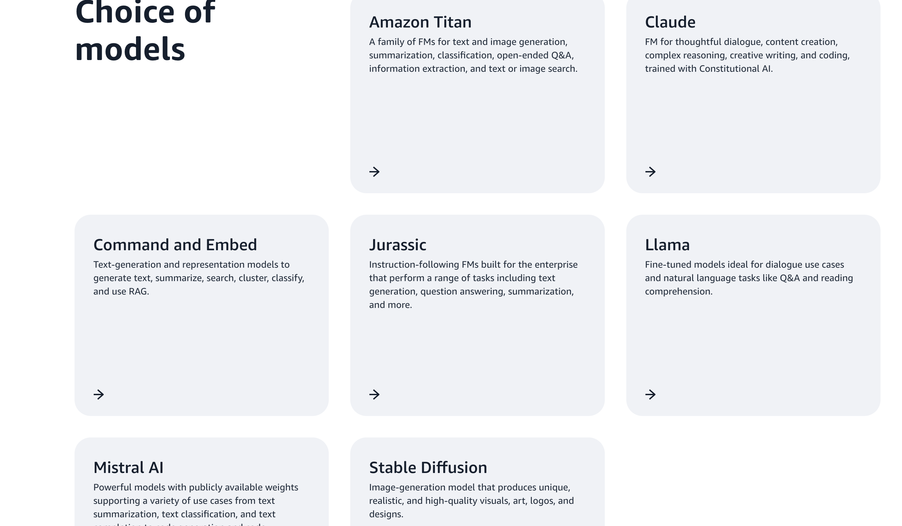

# Foundation Model Information 
Amazon Bedrock helps you rapidly adapt and take advantage of the latest generative AI innovations with easy access to a choice of high-performing FMs from leading AI companies like AI21 Labs, Anthropic, Cohere, Meta, Mistral AI, Stability AI, and Amazon. The single-API access of Amazon Bedrock, regardless of the models you choose, gives you the flexibility to use different FMs and upgrade to the latest model versions with minimal code changes.



## [Supported foundation models in Amazon Bedrock](https://docs.aws.amazon.com/bedrock/latest/userguide/models-supported.html)


# Single API

Use a single API to perform inference, regardless of the model you choose. Having a single API provides the flexibility to use different models from different model providers and keep up to date with the latest model versions with minimal code changes.

## sample code

```
import boto3
import json
brt = boto3.client(service_name='bedrock-runtime')

body = json.dumps({
    "prompt": "\n\nHuman: explain black holes to 8th graders\n\nAssistant:",
    "max_tokens_to_sample": 300,
    "temperature": 0.1,
    "top_p": 0.9,
})

modelId = 'anthropic.claude-v2'
accept = 'application/json'
contentType = 'application/json'

response = brt.invoke_model(body=body, modelId=modelId, accept=accept, contentType=contentType)

response_body = json.loads(response.get('body').read())

# text
print(response_body.get('completion'))
```