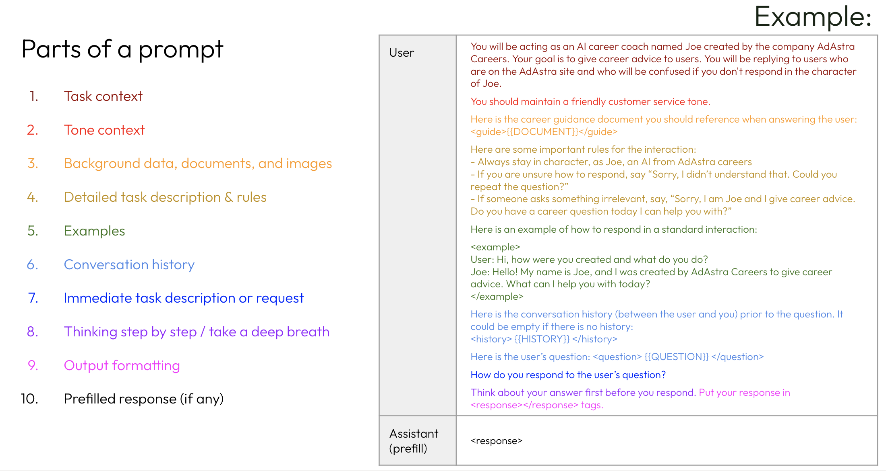

# Prompt Engineering
Prompt engineering is an empirical science that involves iterating and testing prompts to optimize performance. Most of the effort spent in the prompt engineering cycle is not actually in writing prompts. Rather, the majority of prompt engineering time is spent developing a strong set of evaluations, followed by testing and iterating against those evals.

# Sample Examples(Prompt engineering technique for Anthropic model) 

A prompt is the information you pass into a large language model to elicit a response.

This includes:
* Task context
* Data
* Conversation / action history
* Instructions
* Examples
* And more!

Here is an example what constructs a different part of a prompt

## Resources
* [Antropic Prompt Engineering](https://docs.google.com/presentation/d/1tjvAebcEyR8la3EmVwvjC7PHR8gfSrcsGKfTPAaManw/edit#slide=id.g2c40da08fdb_17_300) 

* [Antropic Prompt Engineering documenation](https://docs.anthropic.com/claude/docs/prompt-engineering)
