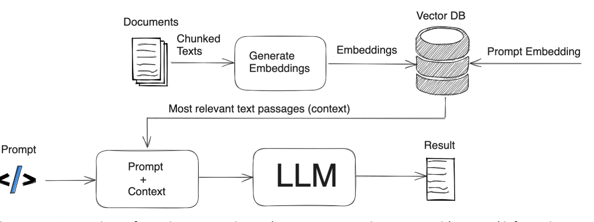

# Retrival Augementation Generation

Retrieval-Augmented Generation (RAG) is the process of optimizing the output of a large language model, so it references an authoritative knowledge base outside of its training data sources before generating a response. Large Language Models (LLMs) are trained on vast volumes of data and use billions of parameters to generate original output for tasks like answering questions, translating languages, and completing sentences. RAG extends the already powerful capabilities of LLMs to specific domains or an organization's internal knowledge base, all without the need to retrain the model. It is a cost-effective approach to improving LLM output so it remains relevant, accurate, and useful in various contexts.

# Architecture

Key components of a RAG Architetcure

* Source data is chunk into smaller pieces and converted to a vector
* These vector/embeddings are stored in a vector database
* When an user asked a question , query also get transalated to a vector and perform serach[key word + semantic] to get most relevant text passages
* Then we submit a final prompt question + context to LLM to get the result

# Sample notebook
* [Bedrock sample](https://github.com/aws-samples/amazon-bedrock-samples/tree/main/rag-solutions)
* [Bedrock Knowledge Base](https://github.com/aws-samples/amazon-bedrock-samples/tree/main/knowledge-bases)

* [Bedrock Workshop](https://github.com/aws-samples/amazon-bedrock-workshop/tree/main/02_KnowledgeBases_and_RAG)

