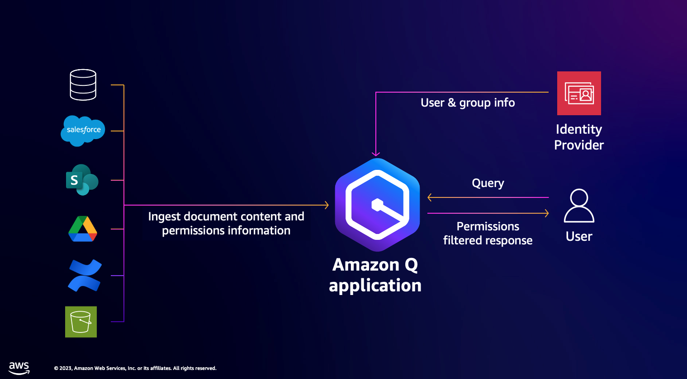
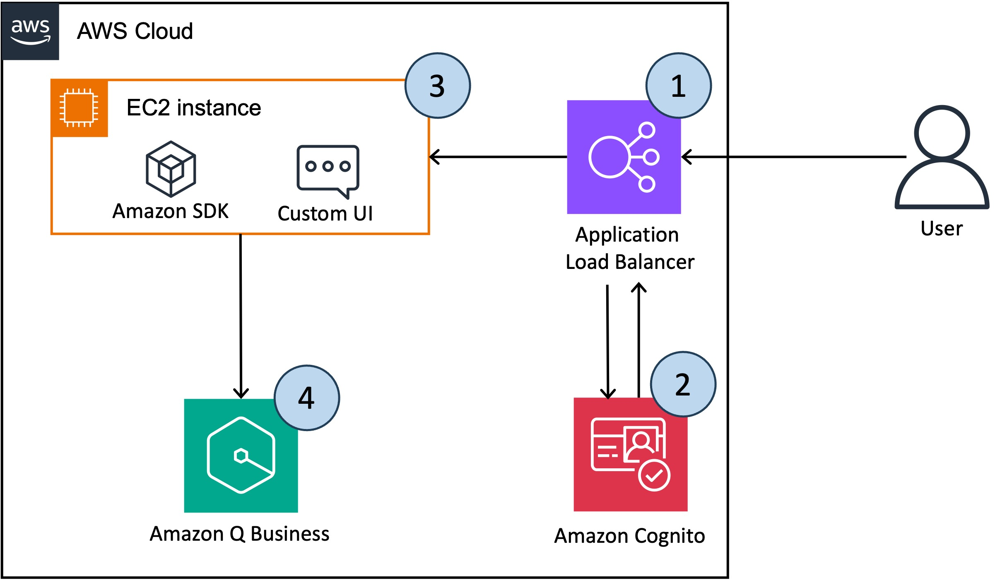

# Amazon Q Business

[Amazon Q Business](https://aws.amazon.com/q/business/) can be tailored to your business by connecting it to company data, information, and systems, made simple with more than 40 built-in connectors. Business users—like marketers, project and program managers, and sales representatives, among others—can have tailored conversations, solve problems, generate content, take actions, and more. Amazon Q Business is aware of which systems they can access, so they can ask detailed, nuanced questions and get tailored results that include only information they are authorized to see.

Amazon Q Business offers over 40 built-in connectors to popular enterprise applications and document repositories, including Amazon Simple Storage Service (Amazon S3), Salesforce, Google Drive, Microsoft 365, ServiceNow, Gmail, Slack, Atlassian, and Zendesk. Bring actionable insights to your employees in one unified experience.

Architetcure : 


The below link provides step  by step guide to set up Amazon Q business application
[Amazon Q Business workshop](https://catalog.workshops.aws/amazon-q-business/en-US/100-introduction)

## Custom Web Experience with Amazon Q Business using Q SDK

Customers often want the ability to integrate custom functionalities into the Amazon Q user interface, such as handling feedback, using corporate colors and templates, custom login, and reducing context switching by integrating the user interface into a single platform. The code repo will show how to use Amazon Cognito for user authentication and use Amazon Q SDK to invoke chatbot application programmatically

Architetcure : 



### Architecture
1.	First the user accesses the chatbot application, which is hosted behind the Load Balancer.
2.	On the first log in attempt the user is be redirected to the Amazon Cognito log in page for authentication. After successful authentication, the user is redirected back to the chatbot application.
3.	The custom UI, deployed on EC2, parses the token to obtain the user and group information, as well as the user's question. 
4.	The UI sends the above information to Amazon Q using the chat_sync boto3 API. AmazonQ return a response containing the answer and the sources used to generate it.

### Chat_sync API of Amazon Q Buisness
 ```python
answer = amazon_q.chat_sync(
        applicationId=amazon_q_app_id,
        userMessage=prompt_input,
        userId = user_id,
        conversationId = conversationId,
        parentMessageId = parentMessageId
    )

  ```

### [sample code](https://github.com/aws-samples/custom-web-experience-with-amazon-q-business/tree/main)

