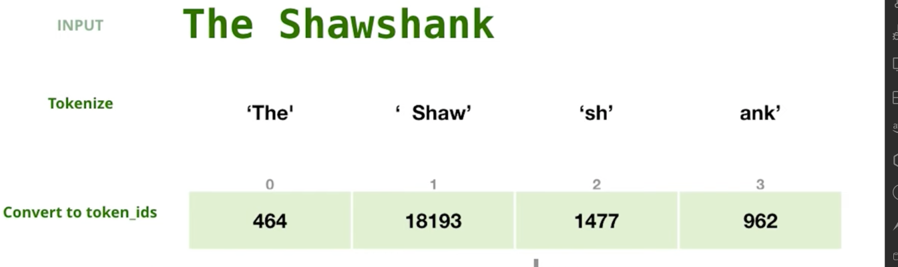
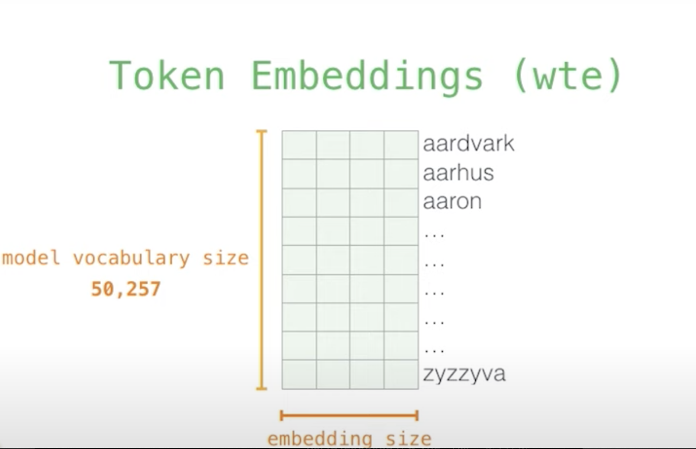
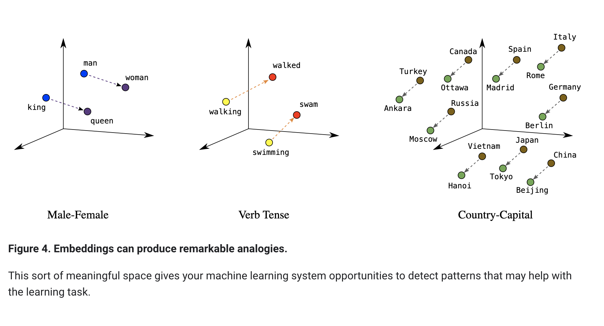
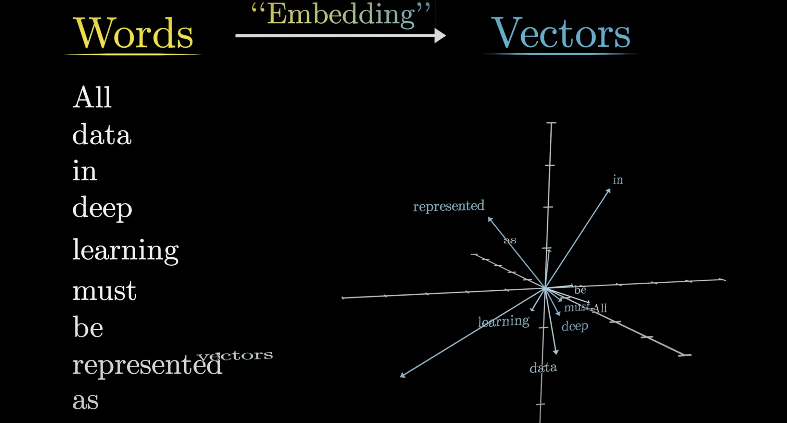
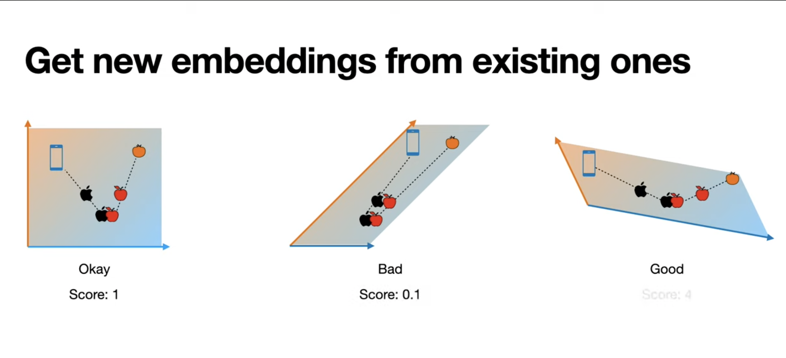
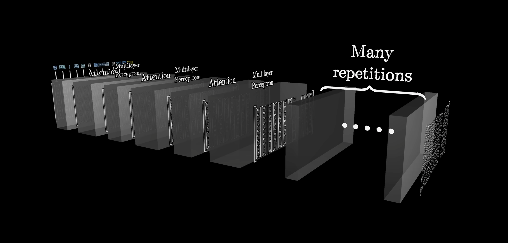
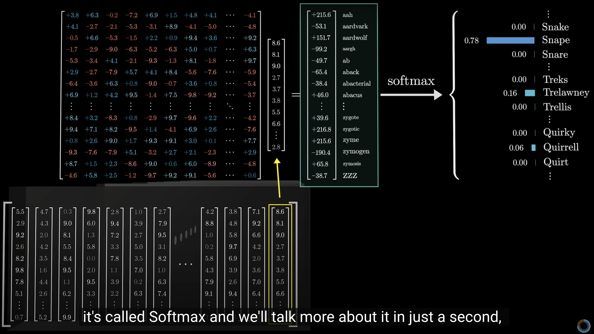

# Generative AI Introduction

## What is generative AI?

Generative AI or generative artificial intelligence refers to the use of AI to create new content, like text, images, music, audio, and videos.

Generative AI is powered by foundation models (large AI models) that can multi-task and perform out-of-the-box tasks, including summarization, Q&A, classification, and more. Plus, with minimal training required, foundation models can be adapted for targeted use cases with very little example data. 

## How does Generative AI work ?

Generative AI models use neural networks to identify the patterns and structures within existing data to generate new and original content.

LLM : 

These model we can call foundation models or/and large language model.

### Foundation Models
Foundation models are a class of AI models pre-trained on vast data across various domains, enabling them to develop a wide range of capabilities. These models are not limited to language tasks but can include image recognition, sound processing, and more. The critical characteristics of foundation models include:

1- **Generalizability** : Through fine-tuning or few-shot learning techniques, they can be applied to a wide range of tasks beyond what they were initially trained on.

2- **Scalability**: They are designed to scale with more data and computational resources, often leading to improved performance.

3- **Transferability** : The knowledge learned by these models can be transferred to various domains and tasks with minimal additional training.

### Large Language Models (LLMs)
LLMs are a subset of foundation models specifically designed for processing and generating human language. They are trained on vast text datasets and can perform translation, summarisation, question answering, and more tasks. LLMs like GPT (Generative Pre-trained Transformer) and BERT (Bidirectional Encoder Representations from Transformers) are prime examples of this technology. Key features include:

1- <u> Language Understanding and Generation </u>: They deeply understand language structure and semantics, allowing them to generate coherent and contextually relevant text.

2- <u> Versatility in Language Tasks </u> : LLMs can be fine-tuned for specific language-based tasks with relatively little additional data.

3- <u> Adaptability </u> : Through techniques like few-shot learning, they can adapt to new tasks by seeing a few examples.

Examples of foundation models include GPT-3 and Stable Diffusion, which allow users to leverage the power of language. For example, popular applications like ChatGPT, which draws from GPT-3, allow users to generate an essay based on a short text request. On the other hand, Stable Diffusion allows users to generate photorealistic images given a text input.

### What happens under the hood of a Language Model ?
Step 1- **Tokenization** : The first step of the process is to convert the words to Ids. As we all know the coumputer only understand number . Tokenization convert words to Ids and back. Every Language model has it's own pre-define set of tokens . 

Step 2- **Embedding** : But these numbers don't have any meaning.The second step is called embedding,which is a process of putting meaning behind these words.

so that the similar words reside in the same space.So we convert each token/number now to a vector.There are different [Embedding Model](https://huggingface.co/spaces/mteb/leaderboard). i.e Cohere Embedding Model has 1024 dimensions,so we can also tell that the cohere embediing model has 1024 feaatures/attributes to classify a word .

Step 3- **Multipile Layer Attention Mechansim** [Attention in Transformer]
Each embedding in the previous step just has the meaning of its own word, and the primary goal of the transformer layer is to pass each vector through multiple layers to soak up the meaning and incorporate the context efficiently. So each vector is pulled towards each other in the embedding space, looking at the surrounding words and context. So in the attention layer focus is what we need to add to the original vector to move it to a specifc direction in the embedding space as a fucntion of the context.so the new refine set of embedding is now having the meaning from surrounding word. 

<u>Let's take two sentences:</u>

Please buy an apple and an orange

apple unveiled the new phone

After attention layer we can see looking at the context the words now pull towards each other 

This steps repat many a times so it gets more context.

Step 4- **Output Projection** In this step we turn the computation back into a language. The output vector shown in the image which is a final layer of multi headed attention layer, multipiled by an embedding matrix , The result of this multiplication is interprted as a score for each word in the model's vocabulary . Then softmax layer then turn those scores into probabilities(all positive, sum up to 1.0)

### Gen AI technology stack [example AWS as a cloud provider]

💽 𝗕𝗼𝘁𝘁𝗼𝗺-𝗟𝗮𝘆𝗲𝗿 (𝗠𝗟 𝗜𝗻𝗳𝗿𝗮𝘀𝘁𝗿𝘂𝗰𝘁𝘂𝗿𝗲 & 𝗙𝗿𝗮𝗺𝗲𝘄𝗼𝗿𝗸𝘀): this is the infrastructure used to train Machine Learning models, and to run these models in production too.

🔧 𝗠𝗶𝗱𝗱𝗹𝗲 𝗟𝗮𝘆𝗲𝗿 (𝗠𝗮𝗰𝗵𝗶𝗻𝗲 𝗟𝗲𝗮𝗿𝗻𝗶𝗻𝗴 𝗧𝗼𝗼𝗹𝘀): SageMaker is Ideal for those wanting to craft their own models or deploy FMs on their infrastructure, all within a managed environment. SageMaker is an end to end platform that provides tools across the entire ML lifecyle

🤖 𝗧𝗼𝗽 𝗟𝗮𝘆𝗲𝗿 (𝗔𝗜 𝗦𝗲𝗿𝘃𝗶𝗰𝗲𝘀): Offers plug-and-play solutions through APIs for immediate use cases. (including Generative AI Services Like Amazon Q)

In the next section we will start exploring each of the Layer.

## Resources
* [Jay Alammar Blog Post and Youtube Channel](https://jalammar.github.io/)
* [Eduardo Ordax](https://www.linkedin.com/in/eordax/)
* [3Blue1Brown](https://www.youtube.com/@3blue1brown)
* [Andrej Karpathy](https://github.com/karpathy/ng-video-lecture)
* [Anthropic](https://transformer-circuits.pub/2021/framework/index.html)
* [Serrano.Academy](https://www.youtube.com/watch?v=OxCpWwDCDFQ)
