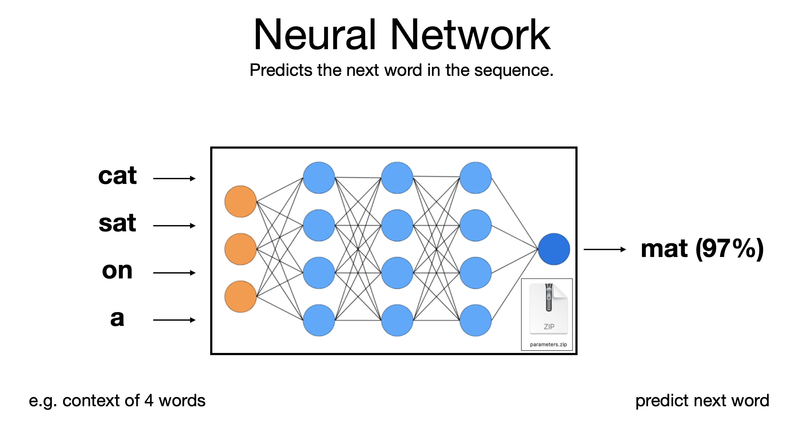

# Generative AI Introduction

## What is generative AI?

Generative AI or generative artificial intelligence refers to the use of AI to create new content, like text, images, music, audio, and videos.

Generative AI is powered by foundation models (large AI models) that can multi-task and perform out-of-the-box tasks, including summarization, Q&A, classification, and more. Plus, with minimal training required, foundation models can be adapted for targeted use cases with very little example data. 

## How does Generative AI work ?

Generative AI models use neural networks to identify the patterns and structures within existing data to generate new and original content.

LLM : 

These model we can call foundation models or/and large language model.

### Foundation Models
Foundation models are a class of AI models pre-trained on vast data across various domains, enabling them to develop a wide range of capabilities. These models are not limited to language tasks but can include image recognition, sound processing, and more. The critical characteristics of foundation models include:

1- Generalizability: Through fine-tuning or few-shot learning techniques, they can be applied to a wide range of tasks beyond what they were initially trained on.

2- Scalability: They are designed to scale with more data and computational resources, often leading to improved performance.

3- Transferability: The knowledge learned by these models can be transferred to various domains and tasks with minimal additional training.

### Large Language Models (LLMs)
LLMs are a subset of foundation models specifically designed for processing and generating human language. They are trained on vast text datasets and can perform translation, summarisation, question answering, and more tasks. LLMs like GPT (Generative Pre-trained Transformer) and BERT (Bidirectional Encoder Representations from Transformers) are prime examples of this technology. Key features include:

1- Language Understanding and Generation: They deeply understand language structure and semantics, allowing them to generate coherent and contextually relevant text.

2- Versatility in Language Tasks: LLMs can be fine-tuned for specific language-based tasks with relatively little additional data.

3- Adaptability: Through techniques like few-shot learning, they can adapt to new tasks by seeing a few examples.

Examples of foundation models include GPT-3 and Stable Diffusion, which allow users to leverage the power of language. For example, popular applications like ChatGPT, which draws from GPT-3, allow users to generate an essay based on a short text request. On the other hand, Stable Diffusion allows users to generate photorealistic images given a text input.

